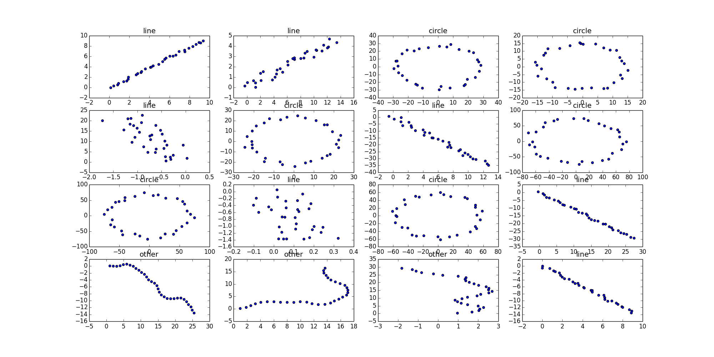

# Gesture recognition with XLA AOT compilation

## Why?

* TensorFlow libraries are large.
* Size is key on mobile devices
* XLA can replace standard nodes with compiled code

## What we will do

* Define a simple model
* Compile that model to a standalone library
* Test it
* Talk about using it on android 

## Prerequisites

Currently you need to build TensorFlow from source to use XLA. XLA must
be enabled in ./configure:
```
Do you wish to build TensorFlow with the XLA just-in-time compiler (experimental)? [y/N] y
```
After this you can build a whl as usual
```sh
$ bazel build -c opt //tensorflow/tools/pip_package:build_pip_package 
$ bazel-bin/tensorflow/tools/pip_package/build_pip_package /tmp/tensorflow_pkg
```
For this project, I am going to use bazel heavily, because it is much easier for XLA AOT compilation. 

## Basic steps

*Make a model*

1. Write the model and add build rule (`gesture.py`, `BUILD`)
2. Train the model
3. Dump checkpoint and graph (`gesture.ckpt`, `gesture.pb`)
4. Freeze the model (`gesture_frozen.pb`)

*Build compact AOTC code*

1. Define proto `gesture.config.pbtxt`
2. Define `tf_library` build rule in `BUILD`
3. Define `gesture_simple.cc` and `BUILD` rule
4. Build and run `gesture_simple`


## 1 Make a model

The main idea is that we have a sequence of mouse or touch drags that form a path. We want to recognize if the path is a circle, line or something else. For simplicity, we train on synthetic data (noisy circles, lines and random paths). They look like this




### 1(i) Write a model

The details of the model are specified in `gesture.py`. Each model is given a class number 0 is circle, 1 is line, and 2 is other. The model is a 1D convolutional Neural network, which is probably crazy overkill for this application.

### 1(i) Preparing your model code for XLA

There are two things that you need to be careful of in building your model. First, you must explicitly name input placeholders and the inference op.
That is because later we'll need to refer to them by name in the xla compile rules to make a AOT compilation.
```python
    self.features = tf.placeholder(shape=[BATCH_SIZE,N,2],dtype=tf.float32,name="features")
    self.labels = tf.placeholder(shape=[BATCH_SIZE,N_CLASSES],dtype=tf.float32,name="labels")
```
To save the model checkpoint and graph you follow a pattern like this:
```python
    # Initialize your model variables
    ...
    # Train your model
    ...
    # Save your model
    saver = tf.train.Saver()
    saver.save(sess, "gesture.ckpt")
    tf.train.write_graph(sess.graph_def, os.getcwd(), "gesture.pb", False)
```

### 1(ii) Training the model

Now we are going to train the model:
```
# train the model... make sure training accuracy is above 90%
cd tensorflow/examples/xla/gesture
bazel  build -c opt gesture
../../../../bazel-bin/tensorflow/examples/xla/gesture/gesture train
# make sure checkpoint works
../../../../bazel-bin/tensorflow/examples/xla/gesture/gesture eval
```

#### Accuracy

Make sure you see a relatively good training accuracy i.e.
```
training accuracy: 0.961589
eval. accuracy:    0.960069
```
If not, just run it again. This is not a super robust model, it is intended for illustration.

### 1(iv) Freezing the model

Now, the only thing left to do to have a fully baked model that we can use is to freeze the checkpoint. This bakes all variable values from the checkpoint into constants that are used to replace the variables in a new graph. This graph is written to `gesture_frozen.pb`. This can be done with the
`freeze_graph.py` command:
```sh
bazel build -c opt //tensorflow/python/tools:freeze_graph
../../../../bazel-bin/tensorflow/python/tools/freeze_graph \
  --input_checkpoint `pwd`/gesture.ckpt \
  --input_graph gesture.pb  \
  --output_node_names out_class --input_binary \
  --output_graph gesture_frozen.pb
```

(Don't forget --input_binary to indicate protos are binary)

## 2 Build compact AOTC code

To compile a library for XLA AOT, you will need to define the inputs and outputs to the model. In this case we know there is only one input "features" which is shape 
`(BATCH_SIZE, N, 2)` or `(256, 32, 2)`. In addition, we know it is type float. In addition we know the output is "out_class" and type integer with shape `(256, 1)`. 

### 2(i) Define inputs and outputs

In `gesture.config.pbtxt` we do
```
# Input has 3 dimensions
feed {
  id { node_name: "features" }
  shape {
    dim { size: 256 }
    dim { size: 32 }
    dim { size: 2 }
    
  }
}
# Fetch the output class
fetch {
  id { node_name: "out_class" }
}
```

### 2(ii) Define tf_library build rule

```
# Use the tf_library macro to compile your graph into executable code.
tf_library(
    name = "gesturelib",
    cpp_class = "Examples::Gesture",
    graph = "gesture_frozen.pb",
    config = "gesture.config.pbtxt",
)
```

### 2(iii) Define gesture_simple.cc and BUILD rule

#### Includes

We now add boilder plate includes

```
\#define EIGEN_USE_THREADS
\#define EIGEN_USE_CUSTOM_THREAD_POOL
\#include "tensorflow/examples/xla/gesture/gesturelib.h"
```


The generated header has a class named `Examples::Gesture`.

#### Thread pool 

Now we setup the thread pool and instantiate the AOT compiled library
```cpp
int main(int argc,char* argv[]){
  Eigen::ThreadPool tp(2);  // Size the thread pool as appropriate.
  Eigen::ThreadPoolDevice device(&tp, tp.NumThreads());
  Examples::Gesture gesture;
  gesture.set_thread_pool(&device);
  ...
```

#### BUILD rule

Now we finally setup the build rule.
```
# The executable code generated by tf_library can then be linked into your code.
cc_binary(
    name = "gesture_simple",
    srcs = [
      "gesture_simple.cc",  # include test_graph_tfmatmul.h to access the generated header
    ],
    deps = [
      ":gesturelib",  # link in the generated object file
      "//third_party/eigen3",
    ],
    includes = [
      "gesture.h"
    ] ,
    linkopts = [     "-lpthread"]
)
```

### 2(iv) Build and run `gesture_simple`

Now we can build our binary
```sh
bazel build -c opt //tensorflow/examples/xla/gesture:gesture_simple
```
Once that is done, run the binary
```
../../../../bazel-bin/tensorflow/examples/xla/gesture/gesture_simple
```
which should produce
```
test 0 is 0
test 1 is 2
test 2 is 1
```
which means (circle, misc, other) which is as is expected

### Bonus

To use Android, you need to setup WORKSPACE in your bazel root. Uncomment
the examples.